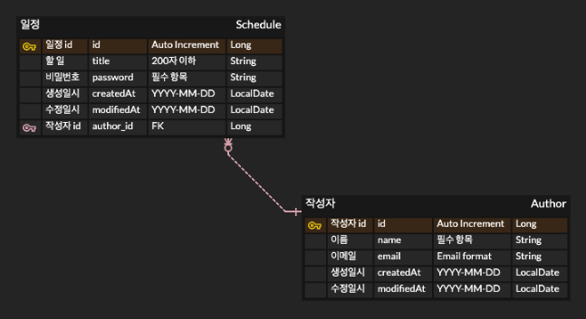

# 카카오테크 캠퍼스 3기 Assignment2

## 일정 관리 앱 만들기

### 1. 📋 API 명세서
[Postman API 명세서 링크](https://documenter.getpostman.com/view/44571097/2sB2qcBLaG)

### 2. 🗂 ERD

### ❗️ 참고 사항
각 단계별 진행 상황은 커밋 기록을 통하여 확인 가능합니다.
